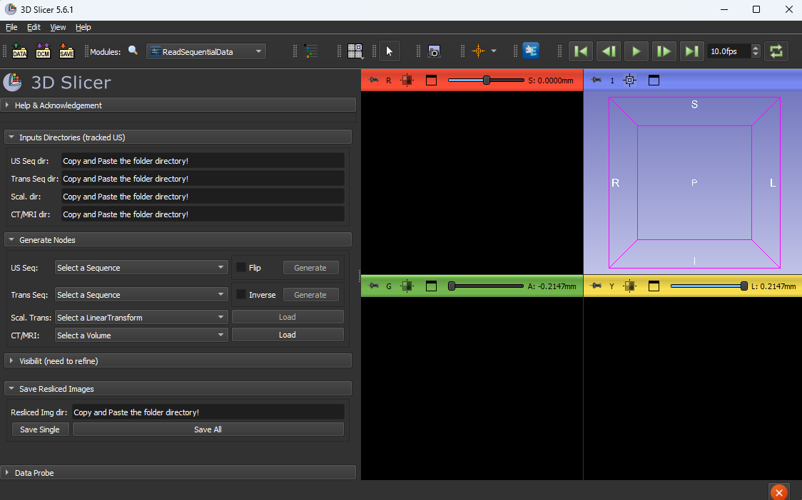
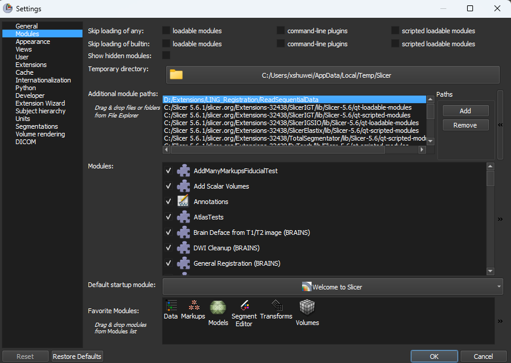

# Slicer module: ReadSequentialData
Objective: this is a 3D Slicer module, which aims to convert the sequential data (images and transforms) to sequence nodes. In 3D slicer, this sequence node can be replayed, edited and transformed.

<p align="center"></p>

# Citation
If you want to use our code for your research, please acknowledge 3D Slicer and cite our publications.
```
COMING SOON!
```

# How to install ReadSequentialData module
- Step 1. load ReadSequentialData module on your 3D Slicer. First, please clone this repository on your local folder.(or you can download the .zip file, and unzip it). Secondly, you need to add the module directory to your 3D Slicer, which is to load ReadSequentialData module, as shown in figure below. <p align="center"></p>
- Step 2. Restart your 3D Slicer, and search module name "ReadSequentialdata". You should be able to find it. Once you open it, it will display as the top figure.

# How to use ReadSequentialData module
- US seq dir. it is to load and convert sequential image data format, such as .png, .jpg and .bmp. The data directory needs to be copy and paste to the blank area. The following screenshot shows how the sequential data looks like.

