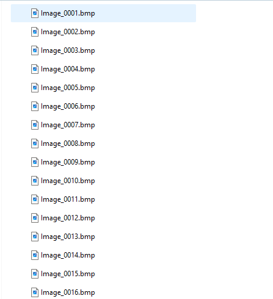

# Slicer module: ReadSequentialData
Objective: this is a 3D Slicer module, which aims to convert the sequential data (images and transforms) to sequence nodes. In 3D slicer, this sequence node can be replayed, edited and transformed.

<p align="center"></p>

# Citation
If you want to use our code for your research, please acknowledge 3D Slicer and cite our publications.
```
COMING SOON!
```

# How to install ReadSequentialData module
- Step 1. load ReadSequentialData module on your 3D Slicer. First, please clone this repository on your local folder.(or you can download the .zip file, and unzip it). Secondly, you need to add the module directory to your 3D Slicer, which is to load ReadSequentialData module, as shown in figure below. <p align="center"></p>
- Step 2. Restart your 3D Slicer, and search module name "ReadSequentialdata". You should be able to find it. Once you open it, it will display as the top figure.

# How to use ReadSequentialData module
- Inputs Directories(tracked US)
1. US seq dir. it is to load and convert sequential image data format, such as .png, .jpg and .bmp. The data directory needs to be copy and paste to the blank area. The following screenshot shows how the sequential data looks like. <p align="center"></p>
2. Trans Seq. similar as the "US seq dir", this one is to convert sequential transforms (.h5, .tfm or .txt). This format should be read by 3D slicer.
3. Scal. dir. This one is to load a single transform.
4. CT/MRI dir. This one is to load .mha or dicom data
- Generate Nodes
1. US Seq. This option is to create a new sequential node (for images). Once you click the button "Generate", the sequential data from "US Seq dir" will be saved to the new sequential node.
2. Trans Seq. Similar as the "US seq". This sequential node will include all the sequential transforms.
3. Scal. Trans. Generate the corresponding transform node.
4. CT/MRI. Generate the new volume node for 3D Slicer
